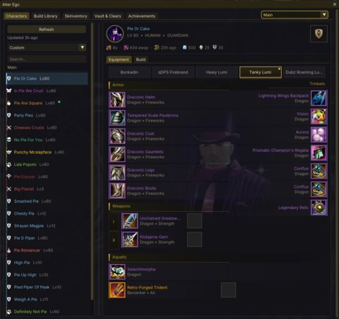
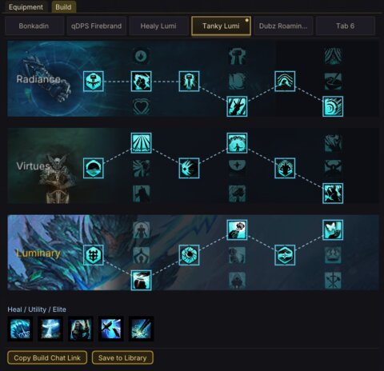
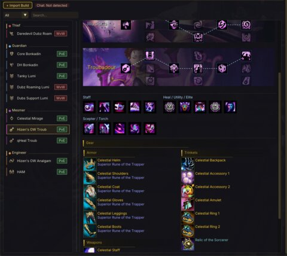
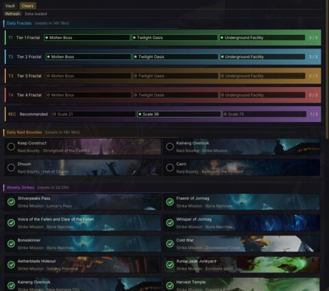
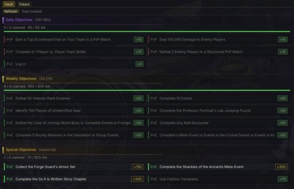
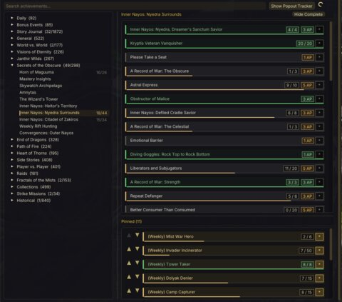
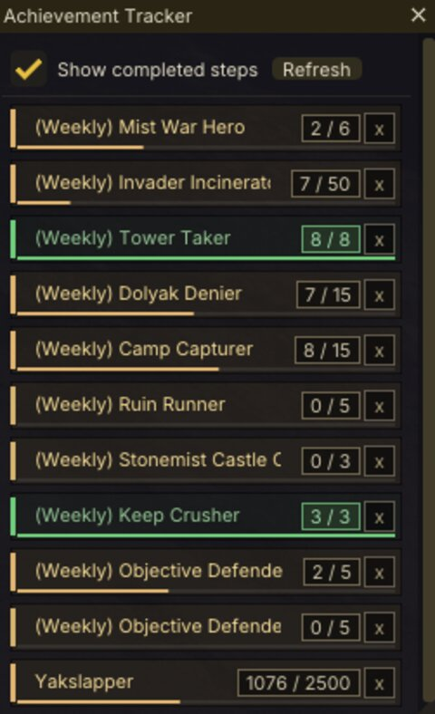
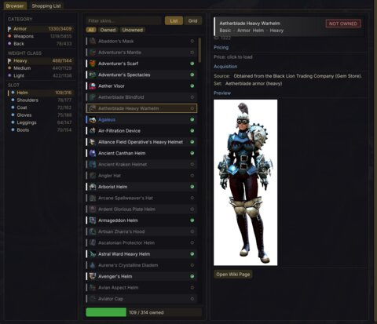

# Alter Ego

A Guild Wars 2 addon for [Raidcore Nexus](https://raidcore.gg/Nexus) that lets you view and manage all your characters, equipment, builds, and saved build templates — all without logging in to each character.

## AI Notice

This addon has been largely created using Claude. I understand that some folks have a moral, financial or political objection to creating software using an LLM. I just wanted to make a useful tool for the GW2 community, and this was the only way I could do it.

If an LLM creating software upsets you, then perhaps this repo isn't for you. Move on, and enjoy your day.

## Screenshots

<table>
  <tr>
    <td align="center"><a href="screenshots/equipment.png"></a><br><sub>Equipment</sub></td>
    <td align="center"><a href="screenshots/build.png"></a><br><sub>Build</sub></td>
    <td align="center"><a href="screenshots/library.png"></a><br><sub>Build Library</sub></td>
  </tr>
  <tr>
    <td align="center"><a href="screenshots/clears.png"></a><br><sub>Vault &amp; Clears</sub></td>
    <td align="center"><a href="screenshots/vault.png"></a><br><sub>Wizard's Vault</sub></td>
    <td align="center"><a href="screenshots/cheevs.png"></a><br><sub>Achievements</sub></td>
  </tr>
  <tr>
    <td align="center"><a href="screenshots/tracker.png"></a><br><sub>Tracker popout</sub></td>
    <td align="center"><a href="screenshots/skinventory.png"></a><br><sub>Skinventory</sub></td>
    <td></td>
  </tr>
</table>

## Features

- **Multi-Account Support** — Switch between GW2 accounts from a single dropdown; all data is per-account
- **Characters** — Full character list with profession, level, and birthday countdown; sortable and drag-to-reorder
- **Equipment** — Paper-doll layout with rarity borders, sigil/rune/infusion tooltips, dye swatches, and custom portraits
- **Builds** — Trait grid and skill bar viewer; copy build chat link to clipboard
- **Build Library** — Save and manage builds with full trait/gear preview; filter by profession and game mode
  - Share full builds (including gear, runes, sigils) via `AE2:` compact codes ([spec →](docs/shared-build-spec.md)) or build-only using in-game chat links
  - Online relay to share builds with the (upcoming) Alter Ego mobile app via short codes
  - Detects AE2 codes in GW2 chat and offers one-click import
- **Skinventory** — Browse all skins, track ownership per account, shopping list, wiki images and prices
- **Vault & Clears** — Wizard's Vault objectives (daily/weekly/special) and raid/fractal completion tracking
  - Vault: meta progress, per-objective acclaim, track, progress, and claimed state
  - Clears: Daily Fractals by tier, Daily Bounties, Weekly Strikes, Weekly Raids per-encounter
- **Achievements** — Full achievement tree with search, pin up to 20 for tracking, floating tracker window, waypoint copy, real-time completion alerts
- **Hoard & Seek Integration** — All API data sourced via [Hoard & Seek](https://github.com/PieOrCake/hoard_and_seek)

## Character Portraits

You can replace the default race concept art in the equipment panel with your own character screenshots.

1. Navigate to your GW2 addons directory: `<GW2>/addons/AlterEgo/portraits/`
   - This folder is created automatically when the addon first runs
2. Save a screenshot with the **exact character name** as the filename:
   - `Woofy Mcdogface.png`
   - `My Cool Character.jpg`
3. Supported formats: `.png`, `.jpg`, `.jpeg`
4. Click the character in the list to refresh the portrait

Portraits are displayed as a semi-transparent overlay with a vignette edge fade. The aspect ratio is preserved automatically. Replacing a portrait file on disk is detected automatically — just click the character again to refresh.

## Requirements

- [Raidcore Nexus](https://raidcore.gg/Nexus) (API v6)
- [Hoard & Seek](https://github.com/PieOrCake/hoard_and_seek) addon (provides character data via GW2 API)
- [Events: Chat](https://raidcore.gg/Nexus) addon (optional — enables chat build detection)
- [Events: Alerts](https://raidcore.gg/Nexus) addon (optional — enables real-time skin unlock and achievement completion detection)

## Installation

Copy `AlterEgo.dll` to your GW2 Nexus addons directory:
```
<GW2>/addons/AlterEgo.dll
```

The addon stores its data (settings, build library, portraits, caches) in:
```
<GW2>/addons/AlterEgo/
```

## Building

Cross-compiled for Windows on Linux using MinGW:

```bash
mkdir build && cd build
cmake ..
make -j$(nproc)
```

Output: `build/AlterEgo.dll`

## Dependencies

- **ImGui 1.80** — Immediate mode GUI (bundled in `lib/imgui/`)
- **nlohmann/json** — JSON parsing (bundled in `lib/nlohmann/`)
- **Nexus API v6** — Raidcore Nexus addon API (header in `include/nexus/`)

## License

MIT
