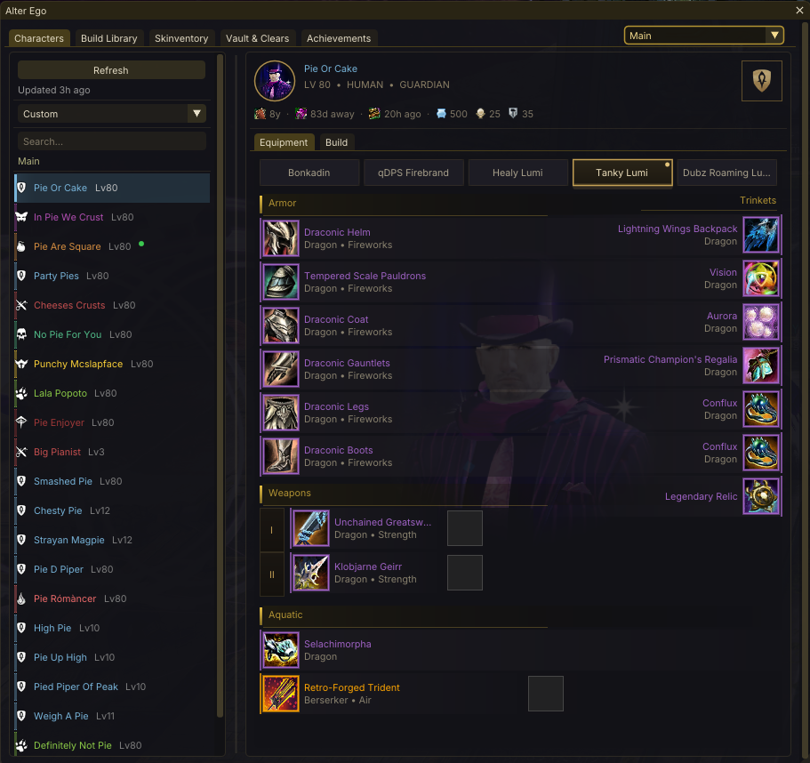
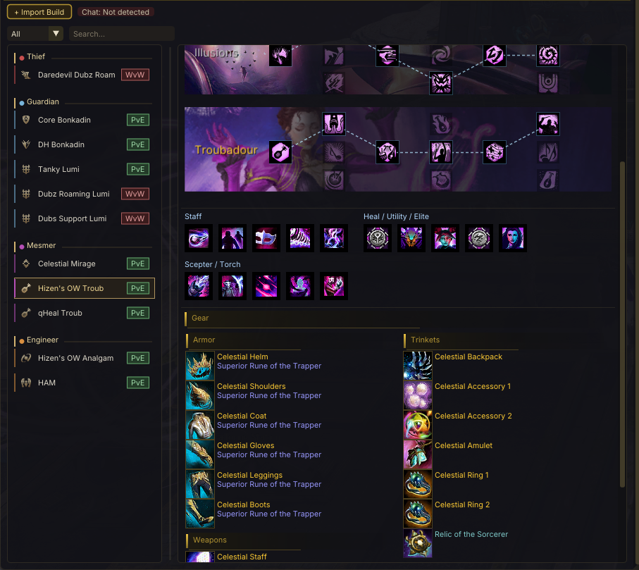
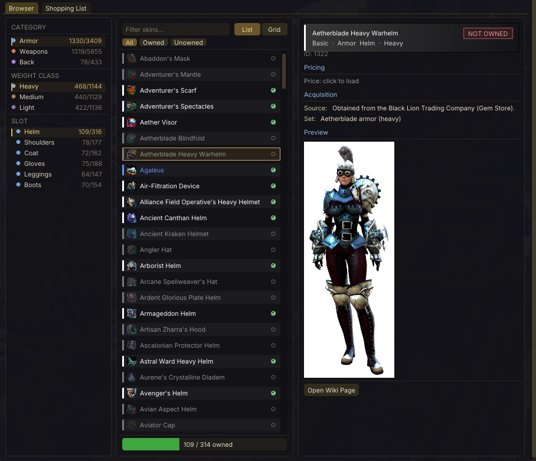

# Alter Ego

A Guild Wars 2 addon for [Raidcore Nexus](https://raidcore.gg/Nexus) that lets you view and manage all your characters, equipment, builds, and saved build templates — all without logging in to each character.

## AI Notice

This addon has been 100% created in [Windsurf](https://windsurf.com/) using Claude. I understand that some folks have a moral, financial or political objection to creating software using an LLM. I just wanted to make a useful tool for the GW2 community, and this was the only way I could do it.

If an LLM creating software upsets you, then perhaps this repo isn't for you. Move on, and enjoy your day.

## Features

- **GW2-Themed UI** — Custom dark slate and gold accent theme with rounded corners, gradient section headers, and polished spacing
  - Profession-colored accent bars and glow effects on character and build list items
  - Scoped to Alter Ego only — won't affect other Nexus addons
- **Character List** — All characters on your account with profession icons, level, and birthday countdown
  - Sort by name, class, level, age, or birthday — or drag to reorder
  - Compact mode option for denser lists
  - Profession-colored accent bars with hover glow effects
- **Equipment Panel** — Full paper-doll layout for each character's equipment tabs
  - Equipment icons with rarity-colored borders
  - Skin/transmutation display with original item info
  - Upgrade (sigil/rune) and infusion tooltips
  - Dye color preview swatches
  - Equipment tab switching
  - Race concept art background with vignette fade
  - Custom character portraits (see [Portraits](#character-portraits) below)
- **Build Panel** — Specialization trait grids with animated marching-ant connection lines
  - Specialization portrait and trait icons with tooltips
  - Heal / Utility / Elite skill bar with icons
  - Build tab switching
  - Copy build template chat link to clipboard
- **Build Library** — Import and manage build templates from chat links
  - Full trait grid and skill bar preview
  - Weapon skills display (with Elementalist attunement and Thief dual-wield support)
  - Gear customization: stat combos, runes, sigils, weapon types
  - Filter by profession and game mode, search by name
  - **Shared Build Templates** — Export/import complete builds (traits + gear) via multiple formats
    - `AE2:` compact binary codes — fits full builds in GW2's 199-char chat limit
    - `AE1:` base64 JSON codes — for Discord/text sharing
    - Raw JSON import/export
    - [Spec for build websites →](docs/shared-build-spec.md)
  - **Chat Build Detection** — Automatically detects AE2 build codes in GW2 chat
    - Toast notification with one-click import to your build library
    - Works across all chat channels (party, squad, whisper, etc.)
- **Skinventory** — Browse all skins in the game, track which you own
  - Filter by type, subtype, weight class
  - Skin detail panel with wiki images, TP prices, vendor prices
  - Shopping list for tracking skins you want to acquire
- **Clears** — Track daily and weekly completion across game modes
  - Daily Fractals grouped by tier with completion status
  - Daily Raid Bounties
  - Weekly Strike Missions (per-encounter tracking)
  - Weekly Raids (per-wing, per-encounter tracking)
  - Auto-refreshes at daily/weekly reset times and every 10 minutes
  - Data cached to disk for instant display on addon load
- **Chat Link Support** — Full import/export of GW2 chat links and build codes
  - Item links (with skin, upgrades, infusions)
  - Build template links
  - Skin links
  - Right-click context menu for copying links
- **Hoard & Seek Integration** — Uses [Hoard & Seek](https://github.com/PieOrCake/hoard_and_seek) as a data source for account-wide character, equipment, and achievement data

## Screenshots







## Character Portraits

You can replace the default race concept art in the equipment panel with your own character screenshots.

1. Navigate to your GW2 addons directory: `<GW2>/addons/AlterEgo/portraits/`
   - This folder is created automatically when the addon first runs
2. Save a screenshot with the **exact character name** as the filename:
   - `Woofy Mcdogface.png`
   - `My Cool Character.jpg`
3. Supported formats: `.png`, `.jpg`, `.jpeg`
4. Click the character in the list to refresh the portrait

Portraits are displayed as a semi-transparent overlay with a vignette edge fade. The aspect ratio is preserved automatically. Replacing a portrait file on disk is detected automatically — just click the character again to refresh.

## Requirements

- [Raidcore Nexus](https://raidcore.gg/Nexus) (API v6)
- [Hoard & Seek](https://github.com/PieOrCake/hoard_and_seek) addon (provides character data via GW2 API)
- [Events: Chat](https://raidcore.gg/Nexus) addon (optional — enables chat build detection)

## Installation

Copy `AlterEgo.dll` to your GW2 Nexus addons directory:
```
<GW2>/addons/AlterEgo.dll
```

The addon stores its data (settings, build library, portraits, caches) in:
```
<GW2>/addons/AlterEgo/
```

## Building

Cross-compiled for Windows on Linux using MinGW:

```bash
mkdir build && cd build
cmake ..
make -j$(nproc)
```

Output: `build/AlterEgo.dll`

## Dependencies

- **ImGui 1.80** — Immediate mode GUI (bundled in `lib/imgui/`)
- **nlohmann/json** — JSON parsing (bundled in `lib/nlohmann/`)
- **Nexus API v6** — Raidcore Nexus addon API (header in `include/nexus/`)

## License

MIT
